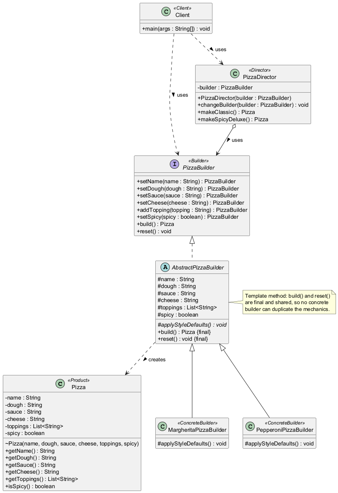

# Assignment #1 — Builder Pattern: Report

**Course:** ShP-2216 Software Design Patterns (OP 6B06102)
**Institution:** Astana IT University — School of Computer Engineering
**Topic:** Builder creational design pattern — Pizza domain
**Language / tooling:** Java 17, Maven, JUnit 5
**Repository:** <https://github.com/CCE-Li/AITU-SDP-Assignment1>

---

## 1. Introduction

**The product.** The project builds **pizzas**. A pizza is a good fit for the Builder
pattern because it is assembled from a fixed set of parts (name, dough, sauce, cheese,
a variable number of toppings) that can be combined in many ways, and because it can
have several *meaningfully different* representations — a thin Italian **Margherita**
versus a thick, spicy **Pepperoni Feast**.

**Why Builder fits this problem.** A pizza has too many constructor parameters to pass
positionally: callers would write `new Pizza("Margherita", "Thin Crust", "Tomato",
"Mozzarella", toppings, false)` and be forced to remember the exact order and to supply
every value even when a sensible default exists. The telescoping-constructor and
JavaBean-setter alternatives are both worse here — the first explodes into overloads,
the second leaves an object mutable and potentially half-initialised. Builder solves
all of this:

- construction happens **step by step** through a fluent, readable chain;
- each **concrete builder** fixes the defaults of one representation, so the client only
  overrides what it cares about;
- the final product is produced in one go by `build()`, which **validates** the
  accumulated state first, so a `Pizza` can never exist in an inconsistent form;
- the `Director` can replay **reusable recipes** (a classic pizza, a spicy deluxe)
  without knowing any concrete class.

---

## 2. UML Class Diagram



Source (PlantUML) is in [`docs/uml.puml`](docs/uml.puml); rendered versions are
[`docs/uml.png`](docs/uml.png) and [`docs/uml.svg`](docs/uml.svg). Re-render with:

```bash
java -jar plantuml.jar -charset UTF-8 -tpng docs/uml.puml
```

**Reading the diagram**

- `PizzaBuilder` is the **Builder** interface: it declares every construction step and
  the terminal `build()` / `reset()`.
- `AbstractPizzaBuilder` implements all steps once and defines the template-method
  mechanics. `build()` and `reset()` are `final`, so no subclass can re-implement (and
  therefore cannot duplicate) them.
- `MargheritaPizzaBuilder` and `PepperoniPizzaBuilder` are the two **ConcreteBuilders**;
  each only overrides `applyStyleDefaults()`.
- `PizzaDirector` is the **Director**; it depends only on `PizzaBuilder`, never on a
  concrete builder, so the same recipes work for both representations.
- `Pizza` is the immutable **Product**; only `AbstractPizzaBuilder.build()` creates it
  (via a package-private constructor).
- `Client` exercises both entry points: director-driven and direct fluent usage.

---

## 3. Clean Code Principles

Seven principles are applied; each is shown with a real excerpt from this code base.

### 3.1 No duplicated construction logic between builders

*The most important fix in this project.* Initially both concrete builders repeated every
setter, the whole defaulting block, and the `reset()` logic — roughly 120 lines that were
almost identical, so a change to the build mechanics had to be made twice.

**Before** (excerpt of the original `PepperoniPizzaBuilder`):

```java
public class PepperoniPizzaBuilder implements PizzaBuilder {

    private Pizza.BuilderState state = new Pizza.BuilderState();
    private boolean spicyExplicitlySet = false;

    @Override public PizzaBuilder setName(String name)  { state.name = name;   return this; }
    @Override public PizzaBuilder setDough(String dough){ state.dough = dough; return this; }
    @Override public PizzaBuilder setSauce(String sauce){ state.sauce = sauce; return this; }
    @Override public PizzaBuilder setCheese(String c)   { state.cheese = c;    return this; }
    @Override public PizzaBuilder addTopping(String t)  { /* ...same as Margherita... */ }
    @Override public PizzaBuilder setSpicy(boolean s)   { state.spicy = s; spicyExplicitlySet = true; return this; }

    @Override public Pizza build() {
        if (state.name == null)  { state.name  = "Pepperoni Feast"; }
        if (state.dough == null) { state.dough = "Thick Crust"; }
        // ...identical structure to MargheritaPizzaBuilder...
        Pizza pizza = Pizza.from(state);
        reset();
        return pizza;
    }

    @Override public void reset() { state = new Pizza.BuilderState(); spicyExplicitlySet = false; }
}
```

**After** — the mechanics live once in the abstract base, and each concrete builder is
reduced to its *difference*:

```java
public final class PepperoniPizzaBuilder extends AbstractPizzaBuilder {

    private static final String STYLE_NAME   = "Pepperoni Feast";
    private static final String STYLE_DOUGH  = "Thick Crust";
    private static final String STYLE_SAUCE  = "Spicy Tomato";
    private static final String STYLE_CHEESE = "Mozzarella + Cheddar";

    @Override
    protected void applyStyleDefaults() {
        name = STYLE_NAME;
        dough = STYLE_DOUGH;
        sauce = STYLE_SAUCE;
        cheese = STYLE_CHEESE;
        toppings.add(SIGNATURE_TOPPING);
        toppings.add(EXTRA_TOPPING);
        spicy = true;
    }
}
```

The setters and `build()`/`reset()` are inherited; `build()` and `reset()` are `final`,
which makes duplication impossible rather than merely discouraged.

### 3.2 Meaningful, intention-revealing names

There are no `d1`, `tmp`, `data2` style names. Fields, methods and constants state intent.

```java
private static void requireText(String value, String fieldName) {
    if (value == null || value.isBlank()) {
        throw new IllegalStateException(
                "Cannot build pizza: '" + fieldName + "' must be set and non-blank");
    }
}
```

`applyStyleDefaults()`, `makeSpicyDeluxe()`, `SIGNATURE_TOPPING` and
`validateRequiredFields()` each read as a sentence describing what they do.

### 3.3 Small methods that each do one thing

`requireText` validates one field. `validateRequiredFields` lists which fields are
required. `build()` only validates then assembles. The `Client` was split from one long
`main` into one named method per scenario:

```java
public static void main(String[] args) {
    System.out.println("=== Builder Pattern Demo: Pizza ===");
    showClassicMargherita();
    showClassicPepperoni();
    showSpicyDeluxeVariant();
    showFluentUsageWithoutDirector();
    showValidation();
}
```

`main` now reads as a table of contents, and each scenario can be understood in isolation.

### 3.4 Validated construction

`build()` refuses to assemble an inconsistent product and reports *which* field is wrong:

```java
@Override
public final Pizza build() {
    validateRequiredFields();
    return new Pizza(name, dough, sauce, cheese, toppings, spicy);
}

private void validateRequiredFields() {
    requireText(name,  "name");
    requireText(dough, "dough");
    requireText(sauce, "sauce");
}
```

Before this change validation lived inside the product and could never actually fire,
because the builders silently filled every field. It is now genuinely reachable and is
demonstrated in `Client.showValidation()` and in `PizzaBuilderTest`:

```
Rejected as expected -> Cannot build pizza: 'name' must be set and non-blank
```

### 3.5 No magic numbers or strings

Every fixed value is a named constant, so a value has one home and its meaning is explicit:

```java
private static final String EXTRA_TOPPING_ONE = "Oregano";
private static final String EXTRA_TOPPING_TWO = "Garlic";
```

```java
private static final String STYLE_DOUGH = "Thin Crust";
```

The `Client` also avoids a repeated literal separator by naming it once:

```java
private static final String SEPARATOR = "----------------------------------------";
```

### 3.6 Immutable product with a defensive copy

The product is `final` and copies the mutable topping list defensively, so no caller can
mutate a built pizza through the getter:

```java
public final class Pizza {
    private final List<String> toppings;

    Pizza(String name, String dough, String sauce, String cheese,
          List<String> toppings, boolean spicy) {
        // ...
        this.toppings = Collections.unmodifiableList(new ArrayList<>(toppings));
    }

    public List<String> getToppings() {
        return toppings;   // unmodifiable
    }
}
```

`PizzaBuilderTest.toppingsAreImmutable` locks this behaviour in.

### 3.7 Program to an interface, not an implementation (with minimal comments)

The director never mentions a concrete builder, so swapping the representation is a
one-line change and needs no edit to any recipe:

```java
public class PizzaDirector {
    private PizzaBuilder builder;          // interface, not a concrete class

    public void changeBuilder(PizzaBuilder builder) {
        this.builder = builder;
    }
}
```

Comments are used only where they explain *why* something is done, not *what* the code
already says — e.g. the note that bespoke pizzas deliberately do not live in the director,
and the single-line Javadoc on `applyStyleDefaults()` explaining that it is re-invoked on
every `reset()`.

---

## 4. Conclusion

**Pros I actually experienced**

- **Readable call sites.** The fluent chain `new PepperoniPizzaBuilder().setName("Extra
  Hot Pepperoni").addTopping("Jalapenos").build()` says exactly what it creates, with no
  parameter-order guessing.
- **Encapsulated defaults.** Adding a third style means adding one class with one method —
  no changes to the director, the client, or the existing builders. This is the pay-off of
  the refactor in §3.1.
- **Impossible invalid states.** Because validation happens in `build()` and the product is
  immutable, an inconsistent `Pizza` cannot escape.
- **Reusable recipes.** The director made the "classic" and "spicy deluxe" configurations
  reusable across both representations without duplicating the step sequence.

**Cons / friction I hit**

- **More classes.** The pattern adds an interface, an abstract base and two concrete
  builders for what a single constructor could express. For a tiny, fixed object it is
  over-engineering; it pays off only when construction is genuinely multi-step or has
  several representations.
- **A real pitfall with stateful builders.** My first refactor made `reset()` apply the
  style defaults, which silently leaked the Margherita signature topping into an intended
  fully-custom pizza. A failing test caught it. The lesson: a builder holds mutable state,
  so the *contract* of `reset()` must be unambiguous.
- **Directors invite over-reach.** My original `PizzaDirector.makeCustom(...)` simply
  re-exposed every setter, duplicating the fluent API and adding nothing. Removing it in
  favour of a genuinely reusable named recipe made the design smaller and clearer — the
  director should own a *known* sequence, not proxy arbitrary client input.
- **Ordering is still the caller's responsibility.** The fluent API cannot prevent a client
  from forgetting a step; only `build()` validation catches that, and only at the end.

**What I would do next** would be to add a `PizzaBuilder` implementation backed by a
different product subtype (e.g. a calzone) to prove the abstract base is truly
representation-agnostic.

---

## 5. Repository

<https://github.com/CCE-Li/AITU-SDP-Assignment1>

The repository contains the full source, the JUnit 5 test suite, this report, and the
PlantUML diagram under `docs/`, with an incremental commit history showing the design
evolving from the initial duplicated implementation to the refactored version.
